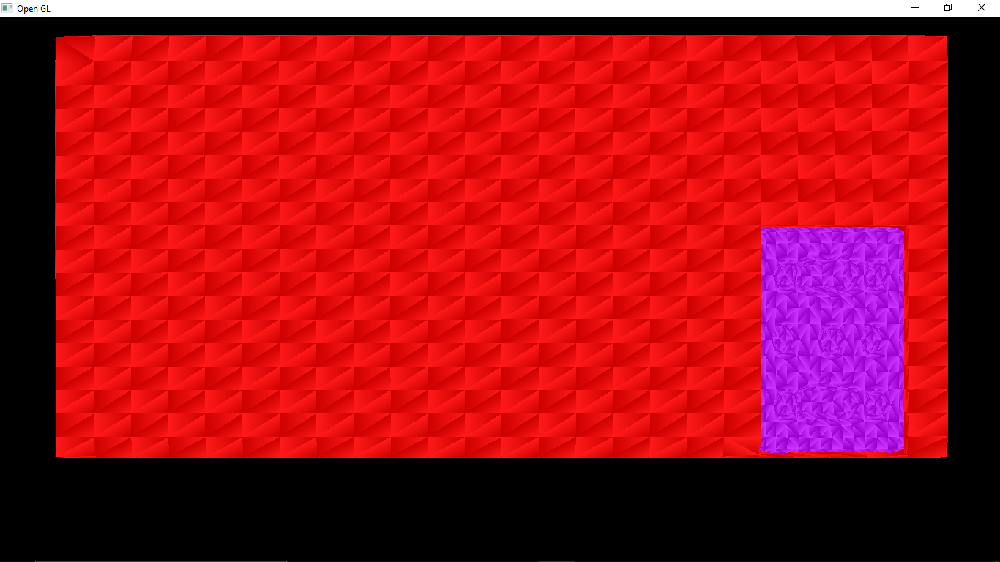
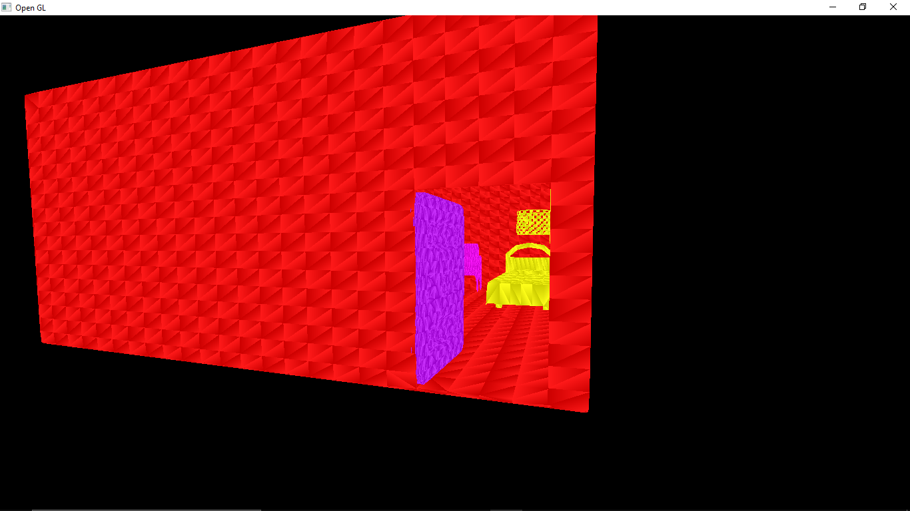
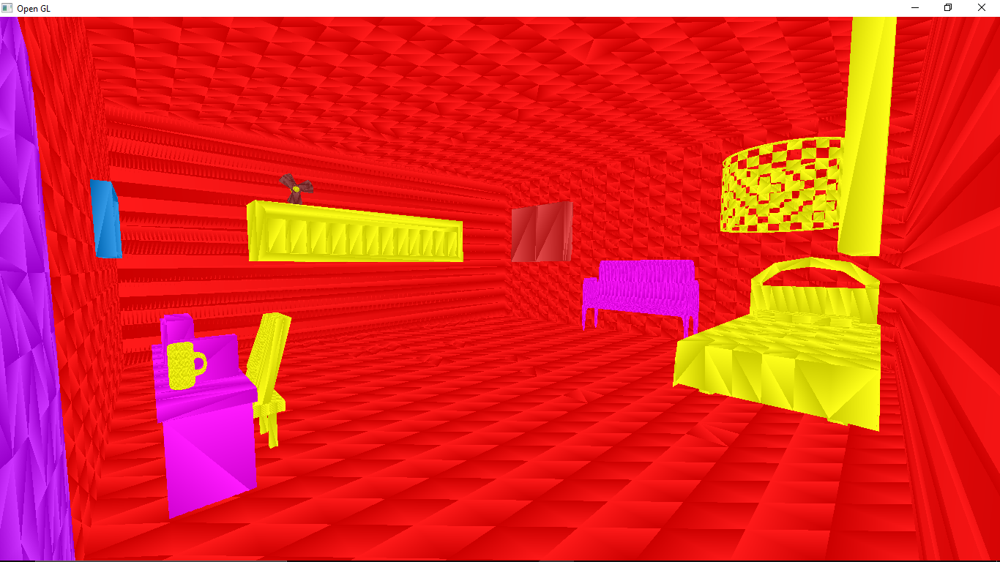
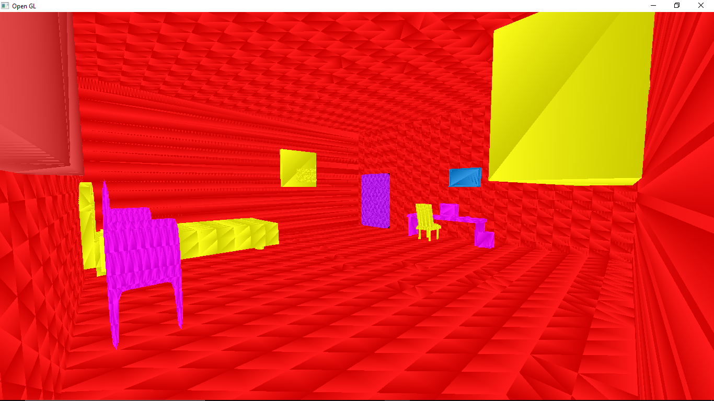
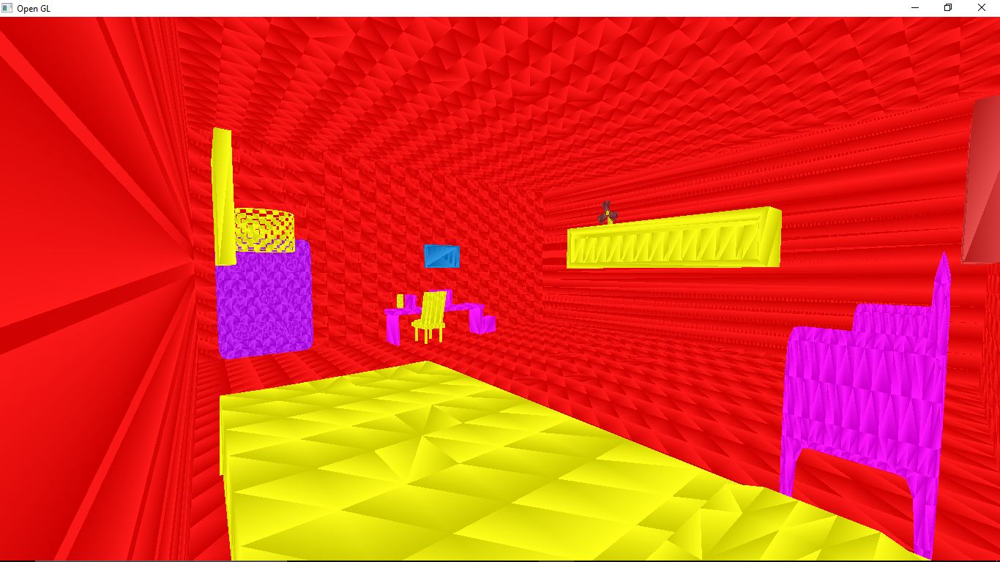
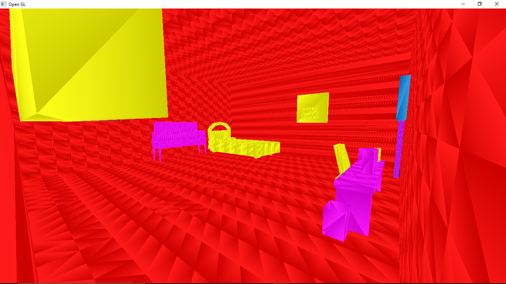

# CG - OPENGL
Repositório criado para a disciplina de Computação Gráfica do 5º período de CC

Referências:

- Equação de rotação de vetores: [Rodrigues Rotation Formula](https://en.wikipedia.org/wiki/Rodrigues%27_rotation_formula)

- Código de importar arquivos no formato Wavefront .obj: [monitoria-cg](https://github.com/valeriojr/monitoria-cg/blob/master/projeto/src/11-carregar_obj.c)

- Biblioteca stb_image: [stb_image.h](https://github.com/nothings/stb/blob/master/stb_image.h)

- Video aulas sobre Camera: [OpenGL - Camera Keyboard Controls](https://www.youtube.com/watch?v=v6RZRPo0O3k)
                            [OpenGL - Camera Vertical Rotation](https://www.youtube.com/watch?v=7oNLw9Bct1k)
                            [OpenGL Camera Tutorial](https://www.youtube.com/watch?v=zHlxQoJYUhw)

## Resultado AB1:

- Link pro vídeo: [Projeto CG AB1](https://www.youtube.com/watch?v=tUBvlIbN5RY)

### Imagens

